# PAWPATROL_BACK
**Integrantes:**
- Juan Pablo Caballero Castellanos.
- Oscar Sanchez.
- Robinson Steven Nuñez.
- David Santiago Palacios.
- Diego Chavarro.

**Nombre De la Rama:**
`feature/proyecto_JuanCaballero_OscarSanchez_DiegoChavarro_RobinsonPortela_SantiagoPalacios_2025-2`

---
## Pruebas de ejecución (Proyecto).
**Maven**
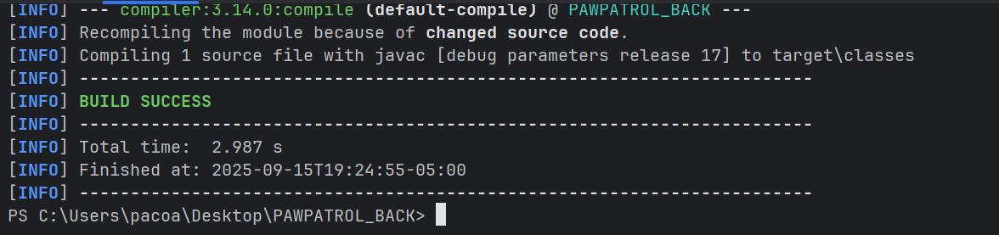
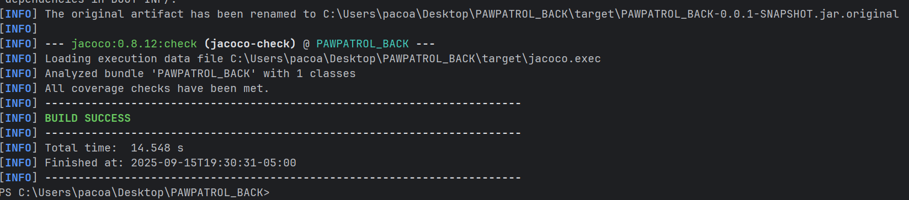
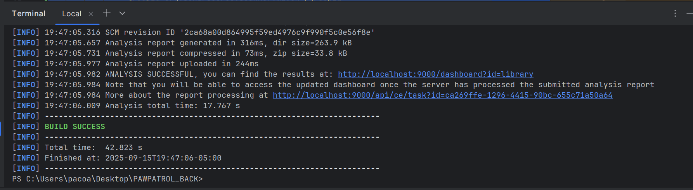

---

## Diagrama de contexto.
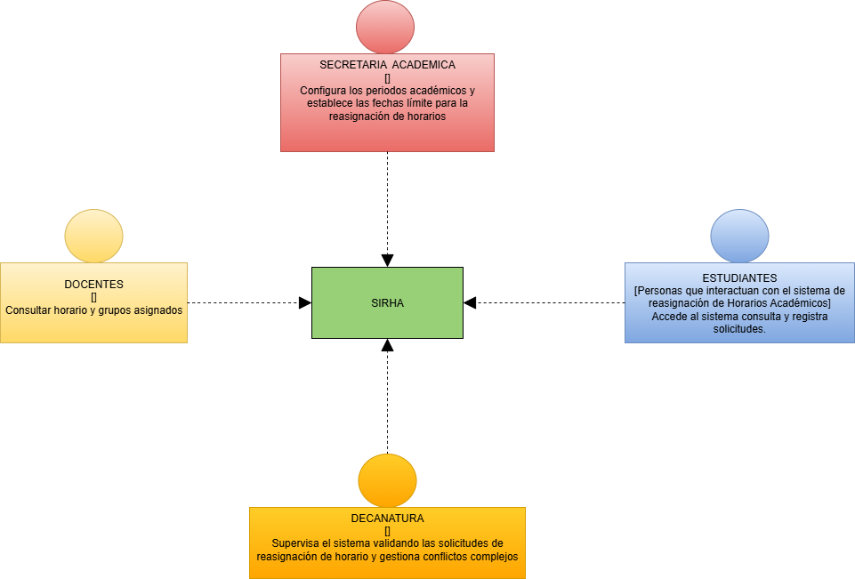

Se realizo el diagrama de Contexto identificando los autores y identificando como interactuan con el sistema de SIRHA

---

## Diagrama de casos de uso.
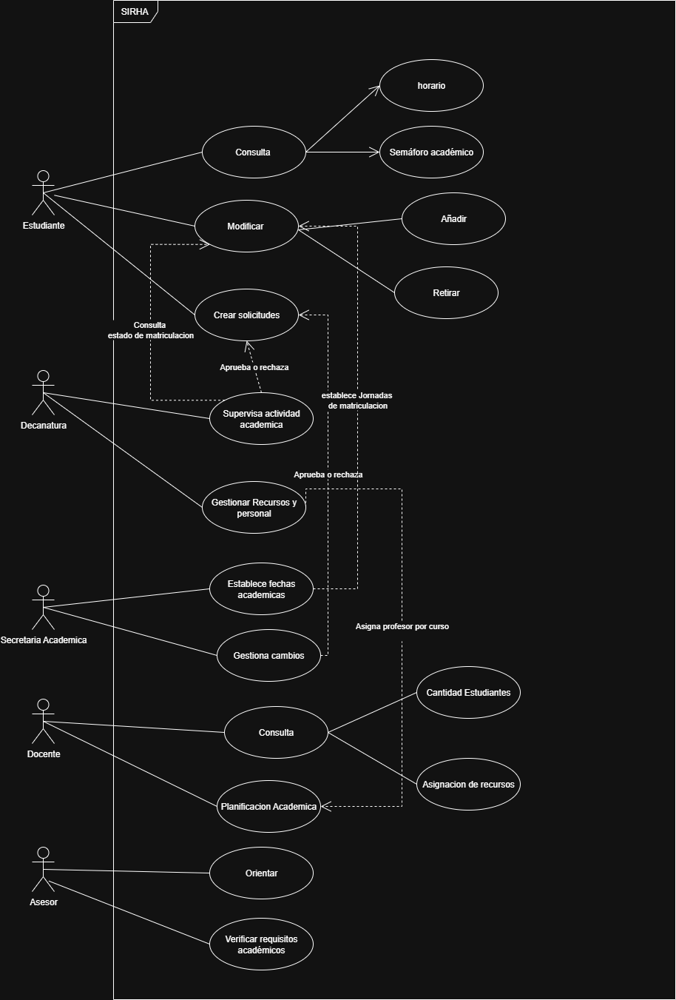

Se realizo el diagrama de casos de uso identificando todos los actores del sistema de horarios, se identifico lo que puede hacer cada uno y se relaciona con las acciones de otros actores

---

## Diagrama de componentes simple.
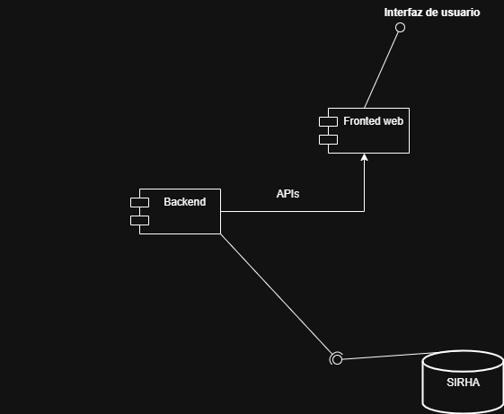

Se realizo el diagrama identificando los componentes del sistema, identificando 2.

- Backend: Es la que recibe los datos de la base de datos de SIRHA y proporciona las APIs al otro componente
- Fronted web: Este componente no recibe ningun dato de la base de datos, solo se encarga de la parte visual del la web

---

## Diagrama de componentes especificos.
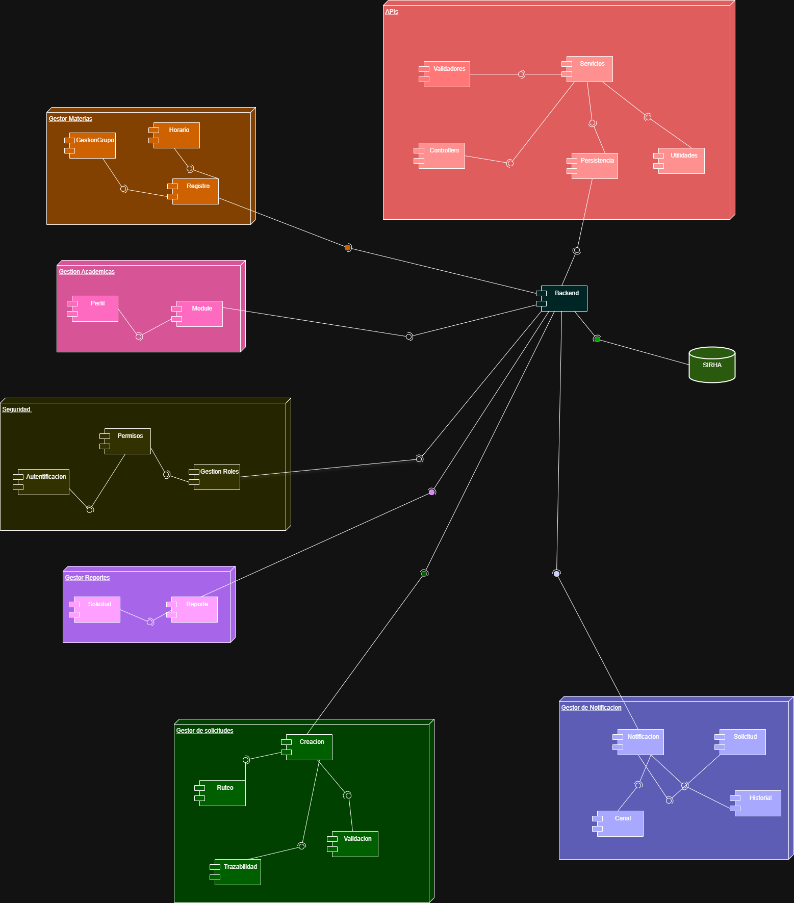

Se realizo el diagrama identificando los subcomponentes que interactuan con el componente backend

- Apis: En su interior se observa todas las iteraciones para la creacion de las APIs.
- GestorMaterias: En su interior maneja todos los componentes que se reciben con la gestion de materias
- GestoAcademico: En su interior maneja todos los componentes que se reciben con la gestion de cada usuario
- Seguridad: En su interior maneja todos los componentes que se encargan de la seguridad del sistema
- GestorReportes: En su interior maneja todos los componentes que se encarga de la logica de los reportes del sistema
- GestorSolicitud: En su interior maneja todos los componentes que se reciben con la gestion de cada solucitud
- GestorNotificacion: En su interior maneja todos los componentes que se reciben con la gestion de cada notificacion

---

## Diagrama de clases.
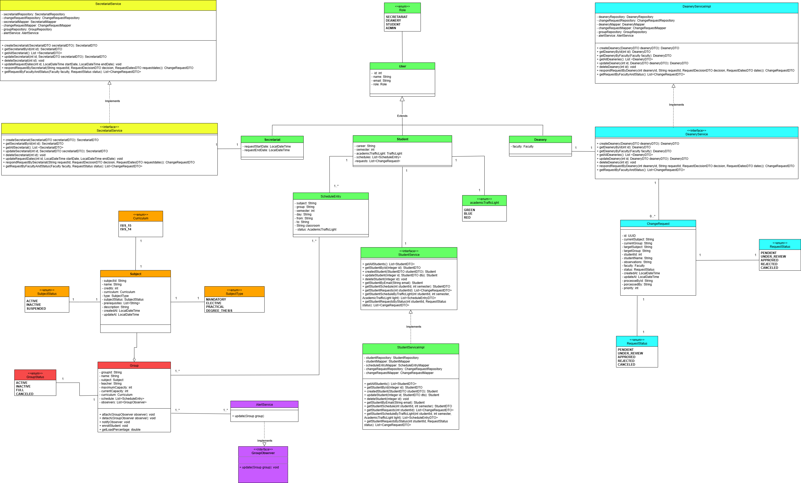

El diagrama de clases aplica varios patrones de diseño:
- Strategy en las validaciones de solicitudes
- Observer para las notificaciones
- Facade en la clase principal Proyecto 
- Factory Method de forma implícita en la jerarquía de User.

En cuanto a los principios SOLID, se cumple:

- S al dar una unica responsabilidad a cada clase
- O al permitir agregar validaciones y notificadores sin modificar el nucleo
- L en la herencia de User y sus subclases
- I al definir interfaces específicas como ILoginService o ValidationStrategy
- D al depender de abstracciones en lugar de implementaciones concretas.
---

## Diagrama de secuencia.

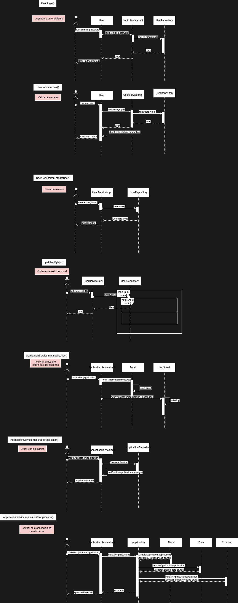
Diagramas basados en casos de uso principales del sistema SIRHA:
- Login / Autenticación de usuario
- Gestión de usuarios (validar/crear usuario)
- Crear solicitud de reasignación (Application)
- Validar solicitud de reasignación
- Notificación del resultado
---

## Diagrama de Base de datos.

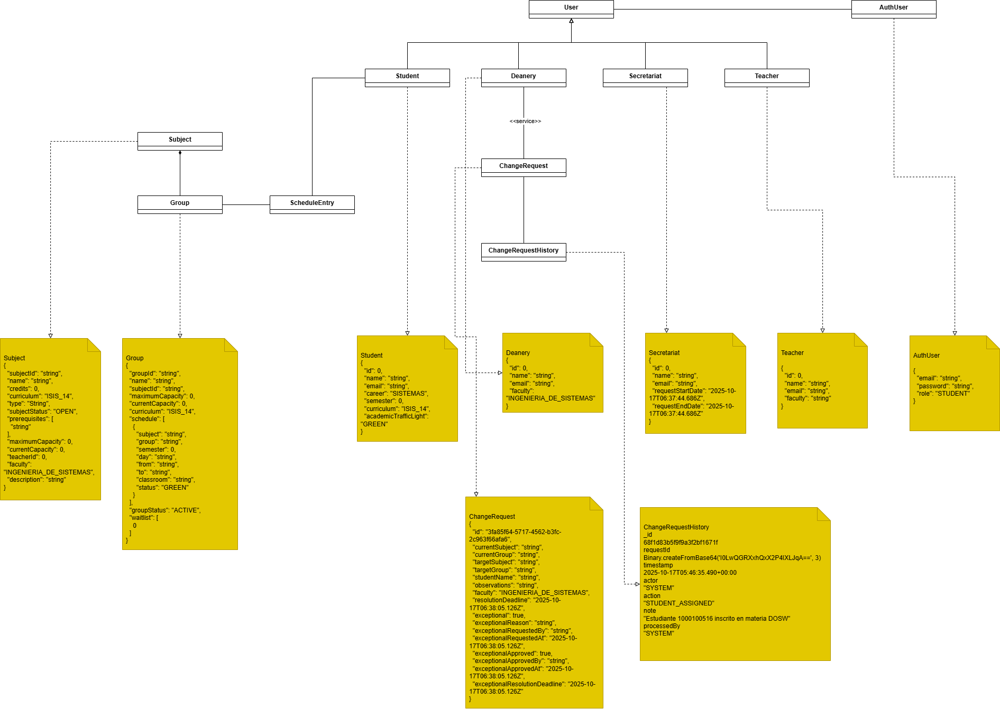

En este diagrama encontramos las tablas(relaciones) que vamos a necesitar para tener una base
de datos suficiente para cumplir con los requisitos y poder administrar de manera correcta la información necesaria.

Encontramos 8 tablas, las cuales son:
- Estudiante, guarda la información de un estudiante(id,carrera,semestre).
- Usuario, guarda la información de un usuario general(sin discriminar estudiante o decanatura)(id,nombre,correo_institucional,contraseña y rol).
- Decanatura, guarda la información de un usuario con el rol de decanatura(id, facultad).
- Materia, guarda la información sobre una materia en especifico(id, codigo, nombre y creditos).
- Grupo, encontramos la información sobre un grupo(de una materia), (id, id_materia,profesor,cupoMaximo y horario).
- Solicitud, es la tabla con más valores ya que contiene la información de una solicitud(id, id_estudiante,id_materia,grupo_origen,grupo_destino,estado,prioridad,fecha_creacion,observaciones).
- DecisiónSolicitud, aqui se guardará la información con respecto a las respuestas por parte de la decanatura a las solicitudes(id, id_solicitud, id_decanatura, fechaRespuesta, resultado y comentarios).
- Inscripcion, esta tabla nos permite llevar un control sobre las inscripciones que realiza y tiene un estudiante(id, id_estudiante, id_grupo, fechaInscripcion).

Con esta estructura nos aseguramos:
- Evitar redundancia de datos (no repetimos la información, usamos llaves foraneas).
- Mantener la integridad (las claves foráneas aseguran que una solicitud no se cree para un grupo inexistente)
- Flexibilidad (es un sistema con tendencia a crecer, sin necesidad de modificar lo que hay).
- Escalabilidad (Al estar normalizada, es más eficiente para operaciones CRUD y consultas).

---

## Implementación autenticación usuario - pruebas (Parte de evidencia)

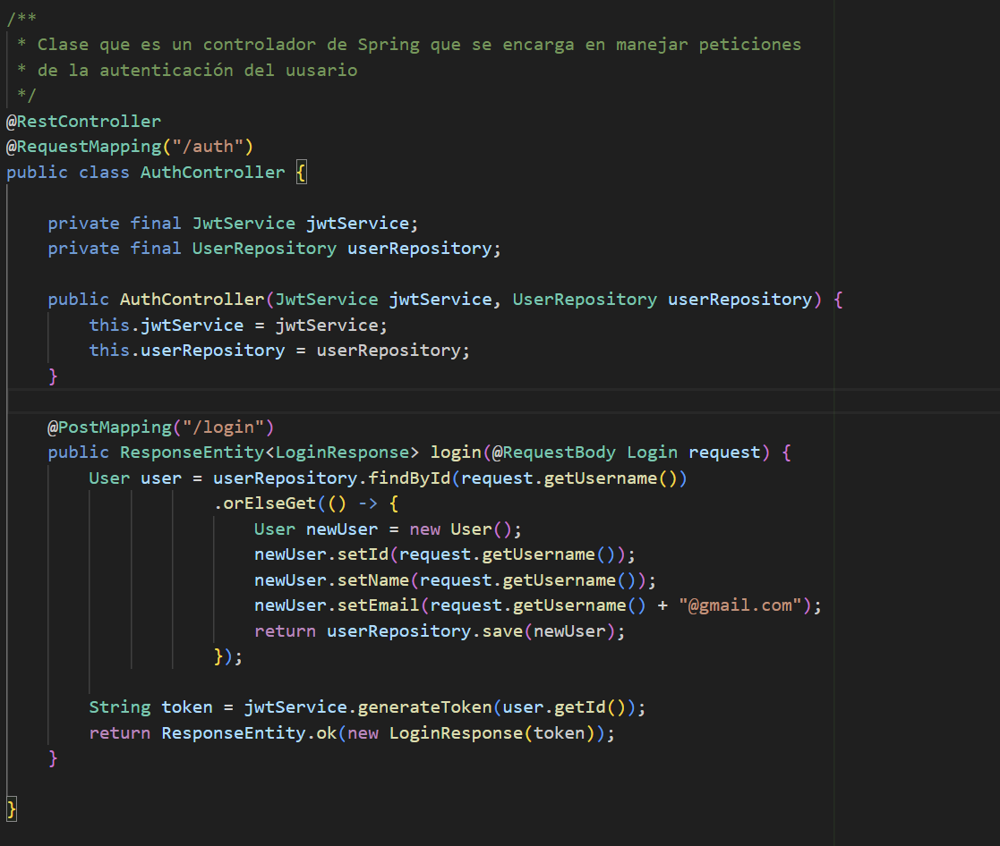

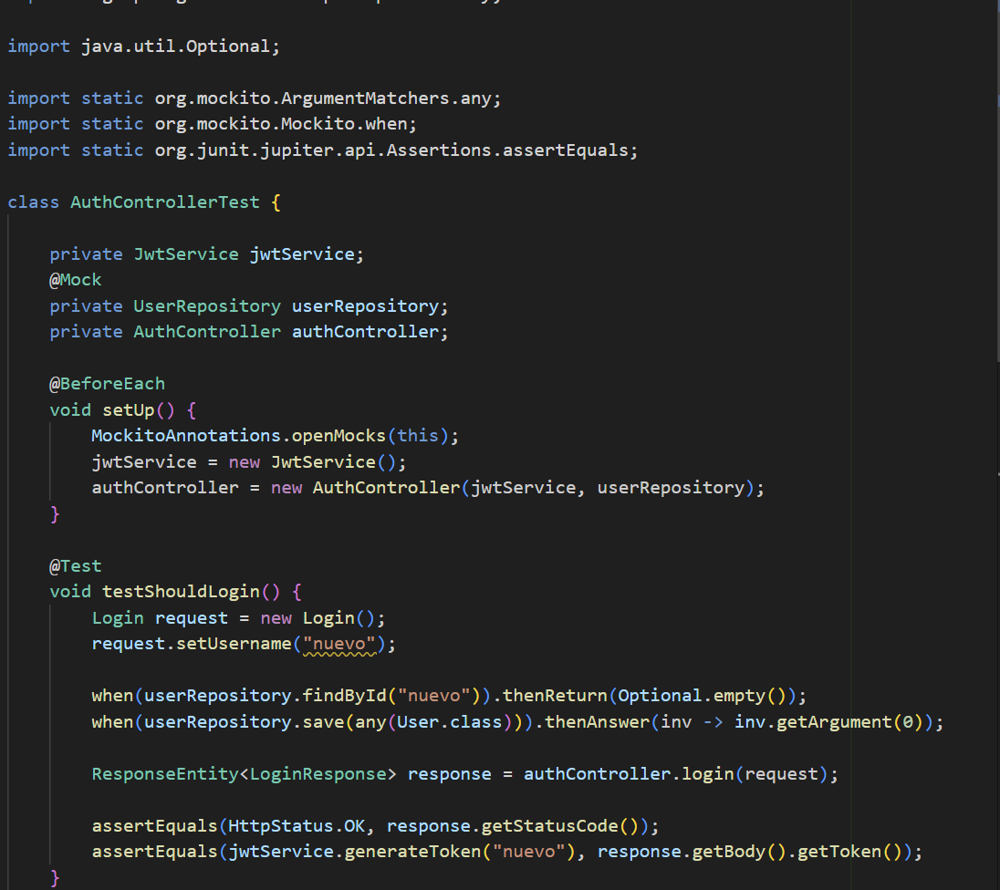

## Endpoints y Swagger 

- SWAGGER UI:

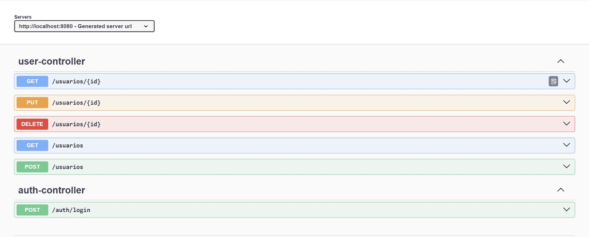

- Prueba swagger utilizando h2:

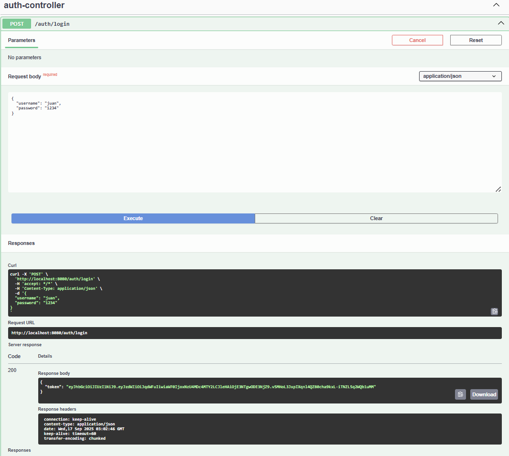

Se realizo la prueba para ver como respondia la base y la autenticación.

- Configuración Swagger:

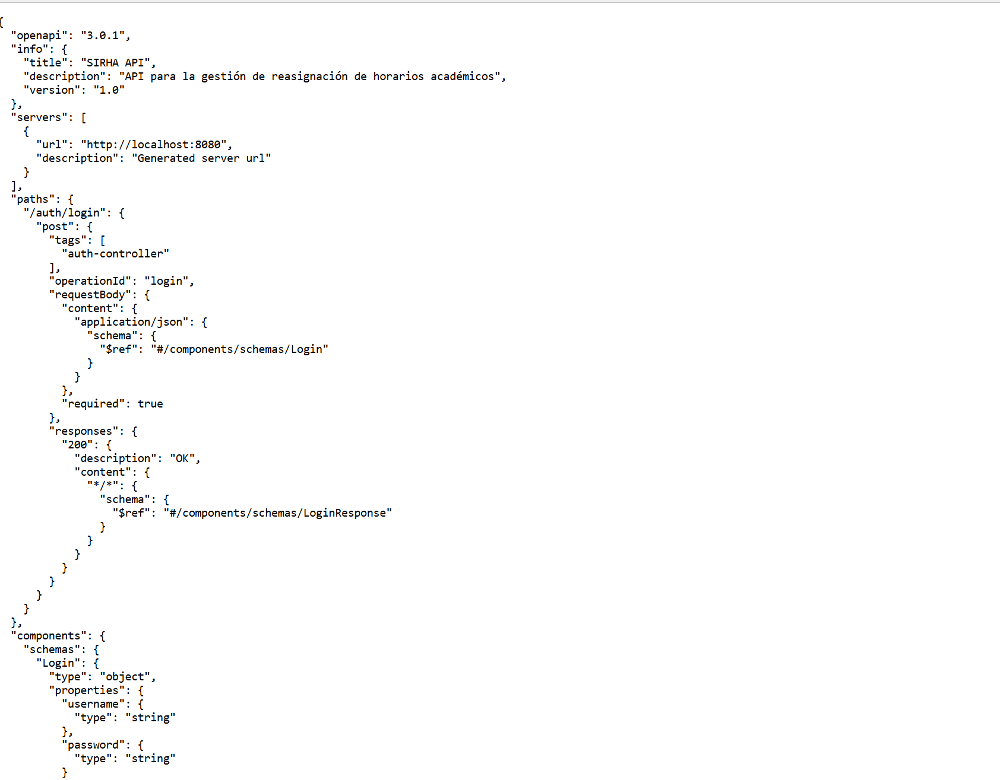

## Base de datos:

- Se logro implementar la base de datos MySQL en el proyecto, se crea dentro una base de datos sirha_dosw:

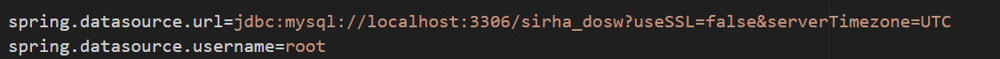

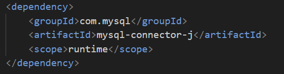

- Hacemos pruebas en la autenticación de usuarios en swager UI y luego se actualiza la base de datos MySQL para ver si se ha enviado información:

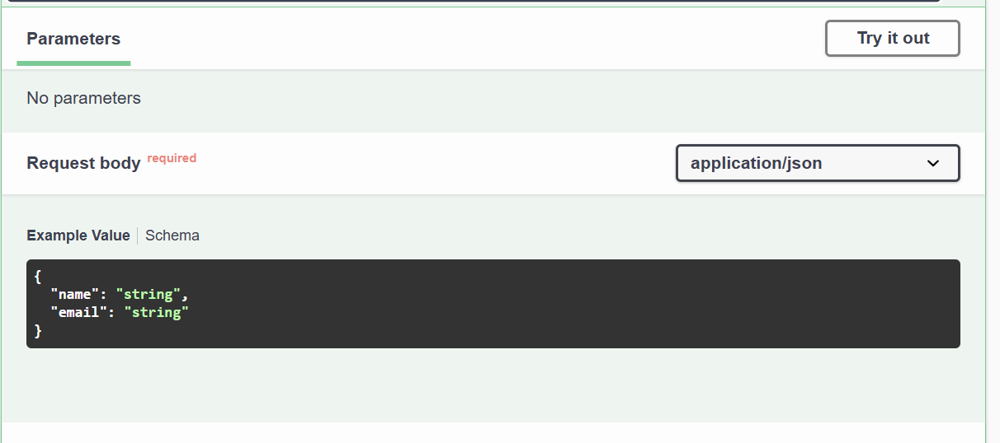

- Se refresca la base de datos y miramos si se creo la tabla de usuarios con la prueba que hicimos:

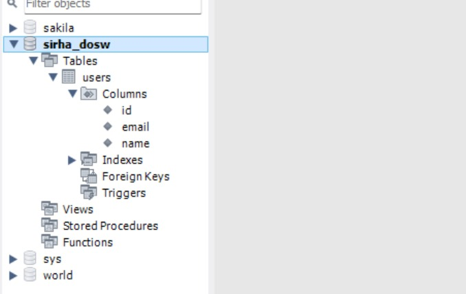

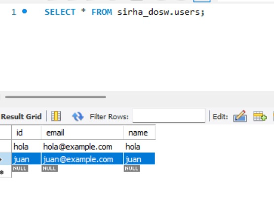

## Cobertura JACOCO y SonarQube

[alt text](docs/imagenes/EjecucionJacoco.jpeg)

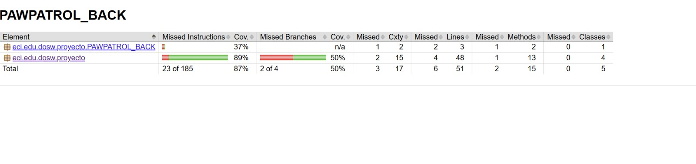

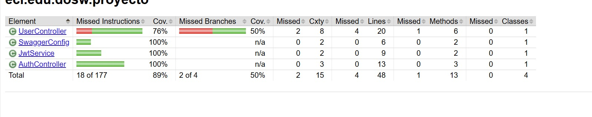

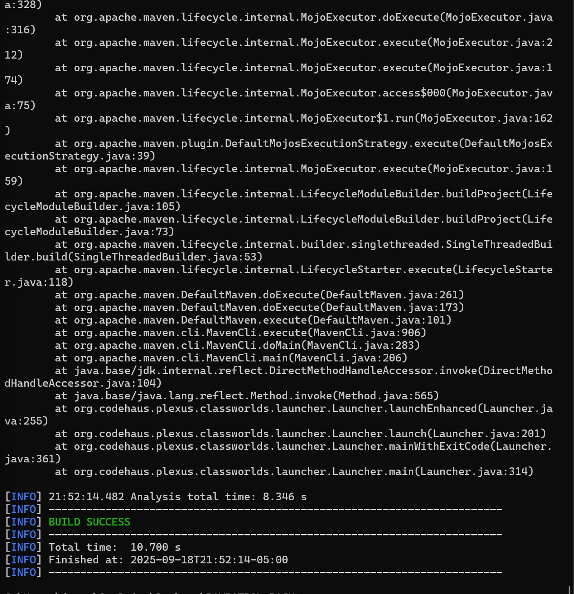

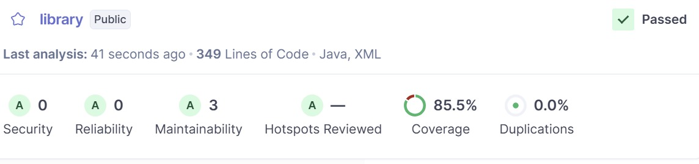

- Como se evidencia las pruebas cubren gran parte del proyecto verificando asi la funcionalidad y mantenimiento del código

## Tablero de JIRA

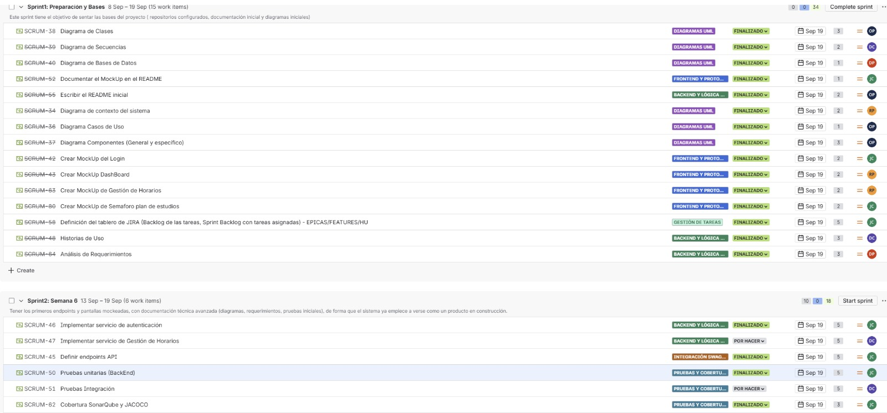

