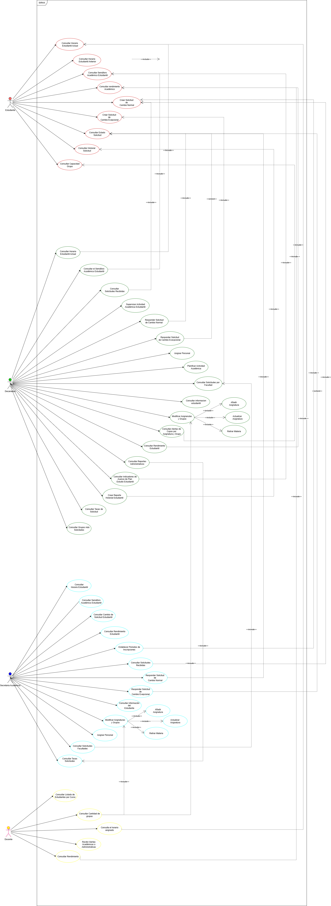
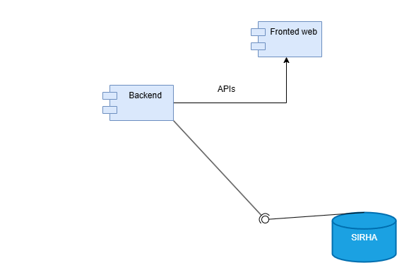
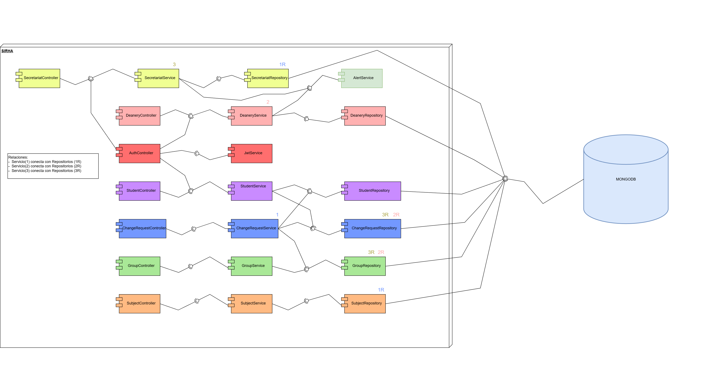
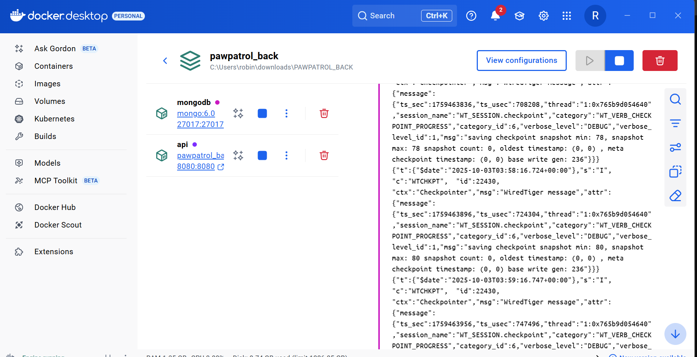
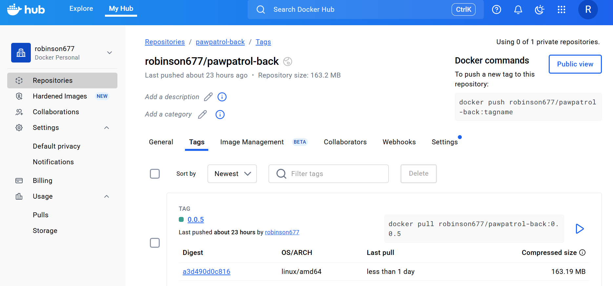

# PAWPATROL_BACK
**Integrantes:**
- Juan Pablo Caballero Castellanos.
- Oscar Sanchez.
- Robinson Steven Nuñez.
- David Santiago Palacios.
- Diego Chavarro.

**Nombre De la Rama:**
`feature/proyecto_JuanCaballero_OscarSanchez_DiegoChavarro_RobinsonPortela_SantiagoPalacios_2025-2`

---

## Estrategia de Versionamiento y ramas.

**Template ramas**
`feature/Tarea_Integrante`

- main: Versión estable para PREPROD
- develop: Rama principal de desarrollo
- bugix/*: Manejo de errores
- release/*: Manejo de versiones.

**Template Commits**
`feature: Tarea - Acción Realizada`

---
## Tecnologías utilizadas

- Java 21
- Spring Boot
- MongoDB
- Swagger (OpenAPI)
- JaCoCo (cobertura de pruebas)
- SonarQube (análisis estático de código)
- Docker(Ejecutar la aplicación en contenedores)
- Maven (gestión de dependencias y build)
- Azure
- Kubernetes
- GitHub Actions

## Arquitectura

El proyecto sigue el patrón MVC (Modelo - Vista - Controlador):

- Models: Entidades de negocio es decir , los objetos que representan la infomación central que maneja la aplicación como lo son los tipos de usuarios, materias, grupos, horarios.

- Repository: Manejo de persistencia en MongoDB, encargado del acceso y manejo de datos. Aqui se implementan operaciones de persistencia, encontrar, actulizar, eliminar documentos que nos permite abstraer la lógica de la base de datos del resto de la aplicación.

- Services: Lógica de negocio de la aplicación. Aqui se definen las operaciones y funcionalidades que que combinan y transforman datos, aplicando las reglas de negocio y coordina la interacción entre los modelos, los controladores y los repositorios.

- Controllers: Exposición de endpoints REST que permiten la comunicación con el usuario. Los controladores reciben solicitudes HTTP, delegan la ejecución de la lógica al servicio correspondiente y le devulva respuestas al usuario.

---

## Diagrama de contexto.

El diagrama de contexto muestra el  sistema central SIRHA y sus relaciones con los actores externos que interactúan con el. SIRAH centraliza la gestion de solicitudes de cambio de horario, aplica las reglas de negocio definidas por la institución y coordina validaciones y autorizaciones.

**Interacciones generales:**

- Secretaría Académica: Configura periodos académicos y fechas limite para permitir que un estudiante haga su solicitud.

- Estudiantes: Consultan horarios disponibles y registran solicitudes de cambio. Reciben notificaciones/respuestas sobre el estado de sus peticiones.

- Docentes:  Consultan sus horarios y grupos asignados para verificar afectaciones o disponibilidades. Normalmente no realizan cambios desde SIRHA, solo consultan.

- Decanatura: Supervisa y valida solicitudes, resolviendo conflictos complejos que el sistema no pueda resolver automáticamente (p. ej. choques entre asignaturas o limitaciones de recursos).
---

## Diagrama de casos de uso.

Deffine la interacción de los usarios dentro del sistema de SIRHA.

**Algunos de ellos y sus interacciones son:**

- Estudiante: Donde este usuario puede hacer consultas ya sea sobre su solicitud, horario según semestres, grupo y su capacidad, y creación de solicitudes según el caso.

- Decanatura: Este usario se le permite consultar información sobre le estudiante, responder solicitudes según su facultad y tipo de solicitud (si es excepcional), consultar las alertas sobre un grupo que este al limite de su capacidad, se le permite asignar profesores capacidad en materias y grupos, crear y consultar reportes sobre un estudiante cantidad de solicitudes.

- Secretaria Académica: Establecer periodos para responder solicitudes y crear solicitudes, consultar solicitudes generalmente o dependiendo del estudiante, prioridad, estado y demás.
---

## Diagrama de componentes general.

Se realizo el diagrama identificando los componentes del sistema, identificando 2.

- Backend: Es la que recibe los datos de la base de datos de SIRHA y proporciona las APIs al otro componente
- Fronted web: Este componente no recibe ningun dato de la base de datos, solo se encarga de la parte visual del la web

---

## Diagrama de componentes especificos.

Se realizo el diagrama identificando los subcomponentes que interactuan con el componente backend

- Apis: En su interior se observa todas las iteraciones para la creacion de las APIs.
- GestorMaterias: En su interior maneja todos los componentes que se reciben con la gestion de materias
- GestorAcademico: En su interior maneja todos los componentes que se reciben con la gestion de cada usuario
- Seguridad: En su interior maneja todos los componentes que se encargan de la seguridad del sistema
- GestorReportes: En su interior maneja todos los componentes que se encarga de la logica de los reportes del sistema
- GestorSolicitud: En su interior maneja todos los componentes que se reciben con la gestion de cada solucitud
- GestorNotificacion: En su interior maneja todos los componentes que se reciben con la gestion de cada notificacion

---

## Diagrama de clases.

### **Patrones de diseño:**

#### **Observer**

Group actúa como el que notifica cambios cuando se llena o alcanza el 90% de capacidad, mientras que GroupObserverService reacciona a esas notificaciones generando alertas o guardando en la base de datos. Asi Group solo gestiona los cupos, y los observadores se encargan de las alertas.

#### **Factory Method**
Se uso ya que nos permitió evitar centralizar la lógica de la validación de los usurios ya que cada uno al entrar en la aplicación SIRHA navega y interactua solo con lo que es de su rol asi evitamos que se mezcle lo que un decano puede hacer y lo que puede hacer un estudiante dentro de la app.

---

### **Principios SOLID:**

#### **Single Responsability:**

- Student se encarga de modelar la informacion del estudiante y gestiona su horario de clases a través de la clase Schedule.

- Request maneja las solicitudes que hacen los estudiantes. Contiene tanto los datos del estudiante como de la facultad, con todo lo necesario para procesar cada una y utiliza HistoryEntry para llevar un registro del historial de cambios de cada solicitud.

- La clase Denary junto con su servicio se ocupan de las operaciones básicas CRUD de las solicitudes que reciben de los estudiantes.

- Group representa un grupo de asignatura y controla el número máximo de estudiantes que puede tener.

#### **Open/Closed:**
Podemos extender la clase abstracta de usuarios para incluir a mas tipo de estos ya que cada uno se logea de igual forma pero cambia lo que pueden
hacer dentro de la aplicación SIRHA, asi no modificamos user ya que es la clase en donde establecemos el método de validar el login para los otros usuarios.

#### **Interface Segregation Principle:**

Se diseño una interfaz concreta y con un unico metodo para establecer un contrato de alertas con Group ya que
implementa un observador que notifica si un grupo esta próximo o ya esta lleno.

#### **Dependency Inversion Principle:**

Group es un modulo de alto nivel por lo que no estamos dependiendo de los modulos de bajo nivel ya que
define el flujo usando y implementando la interfaz de observer asi trabaja con abstracciones no con clases concretas.

## Diagramas de secuencia.

Diagramas basados en casos de uso principales del sistema SIRHA:
- Login / Autenticación de usuario
- Gestión de usuarios (validar/crear usuario)
- Crear solicitud de reasignación (Application)
- Validar solicitud de reasignación
- Notificación del resultado
---

## Diagrama de Base de datos.

En este diagrama encontramos las tablas(relaciones) que vamos a necesitar para tener una base
de datos suficiente para cumplir con los requisitos y poder administrar de manera correcta la información necesaria.

Encontramos 8 tablas, las cuales son:
- Estudiante, guarda la información de un estudiante(id,carrera,semestre).
- Usuario, guarda la información de un usuario general(sin discriminar estudiante o decanatura)(id,nombre,correo_institucional,contraseña y rol).
- Decanatura, guarda la información de un usuario con el rol de decanatura(id, facultad).
- Materia, guarda la información sobre una materia en especifico(id, codigo, nombre y creditos).
- Grupo, encontramos la información sobre un grupo(de una materia), (id, id_materia,profesor,cupoMaximo y horario).
- Solicitud, es la tabla con más valores ya que contiene la información de una solicitud(id, id_estudiante,id_materia,grupo_origen,grupo_destino,estado,prioridad,fecha_creacion,observaciones).
- DecisiónSolicitud, aqui se guardará la información con respecto a las respuestas por parte de la decanatura a las solicitudes(id, id_solicitud, id_decanatura, fechaRespuesta, resultado y comentarios).
- Inscripcion, esta tabla nos permite llevar un control sobre las inscripciones que realiza y tiene un estudiante(id, id_estudiante, id_grupo, fechaInscripcion).

Con esta estructura nos aseguramos:
- Evitar redundancia de datos (no repetimos la información, usamos llaves foraneas).
- Mantener la integridad (las claves foráneas aseguran que una solicitud no se cree para un grupo inexistente)
- Flexibilidad (es un sistema con tendencia a crecer, sin necesidad de modificar lo que hay).
- Escalabilidad (Al estar normalizada, es más eficiente para operaciones CRUD y consultas).
_ _ _

## Configuracion base de datos MongoDB

[Ver Configuración(PDF)](docs/pdf/BaseMongoDB.pdf)

### DOCKERIZACIÓN DE LA APPI

*Video:*

https://youtu.be/QJJyAQXGyAM

1. Se Creo el archivo Dockerfile en IntelliJ y se ajusto el path a JDK 21 y se verifico el
   .jar del proyecto que es `PAWPATROL_BACK-0.0.5.jar`
2. Luego se creo un .dockerignore para no almacenar cosas innecesarias en el proyecto
3. Y otro archivo .yml para usar nuestro proyecto de manera local y con mongo docker-compose.local
4. Posteriormente se descargo  mongo con el comando  `docker pull mongo:6.0`
5. Compilamos el proyecto  con  `mvn -DskipTests clean package`
6. Levantamos el Docker con el comando:  `docker compose -f docker-compose.local.yml up -d --build`
7. Luego subimos nuestra imagen a Docker Hub: https://hub.docker.com/repositories/robinson677?_gl=1*habqp2*_gcl_au*MzI4MDkxODgwLjE3NTcxMzc2OTM.*_ga*NTIxOTAwOTExLjE3NTcxMzc2OTM.*_ga_XJWPQMJYHQ*czE3NTkzODQzNDQkbzQkZzEkdDE3NTkzODUzMDckajYwJGwwJGgw
8. Hice login Write-Output `Mi token | docker login --username robinson677 --password-stdin`
9. Y casi finalizando se creo la imagen `docker build -t robinson677/pawpatrol-back:0.0.5 .`
10. Finalmente se le hizo push Haz push:  `docker push robin123/pawpatrol-back:0.0.5`
11.  Si se quiere probar la imagen:

docker pull robinson677/pawpatrol-back:0.0.5
docker run --rm -p 8080:8080 `
  -e SPRING_DATA_MONGODB_URI="mongodb://<host>:27017/sirha" `
-e SPRING_PROFILES_ACTIVE=docker `
robinson677/pawpatrol-back:0.0.5

---

**Evidencia en Docker Desktop:**

**Evidencia de la imagen en Docker Hub:**

--- 

## DESPLIEGUE API KUBERNETES

Kubernets:

[Ver el reporte (PDF)](docs/pdf/Kubernets.pdf)

- Una vez tenemos la imagen de Docker y verificamos de que se compila y genera el .jar, la probamos localmente:

docker build -t pawpatrol:1.0 .
docker run -p 8080:8080 pawpatrol:1.0

- Ahora aqui se crean arhcivos de Kubernetes (deployment, service).yaml, con el fin de describir la configuracion de los recursos a desplegar (puerto, copias, imagen docker). Aplicamos los archivos:

kubectl apply -f kubernetes/deployment.yaml
kubectl apply -f kubernetes/service.yaml

- luego abrimos en el navegador localhost para verificar el funcionamiento de los enpoints definidos.

